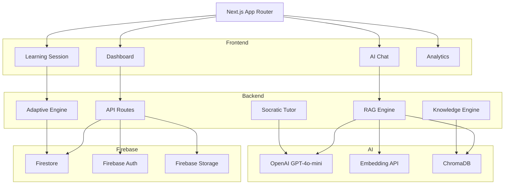

# Shadow Partner — AI Personalized Learning Platform

MVP-first scalable adaptive learning platform using Next.js, Firebase, OpenAI, and RAG.

---

# Overview

Shadow Partner is an AI-powered adaptive learning system that:

- breaks educational materials into atomic learning blocks
- adapts learning paths based on student mastery
- provides AI tutoring using RAG
- uses Socratic teaching methodology
- tracks progress in realtime
- scales serverlessly

The platform is optimized for:

- hackathons
- MVPs
- fast deployment
- low infrastructure cost
- high scalability

---

# Final Tech Stack

| Layer | Technology | Purpose |
|---|---|---|
| Frontend | Next.js App Router | Fullstack React framework |
| Styling | Tailwind CSS + shadcn/ui | Modern UI |
| Authentication | Firebase Auth | User authentication |
| Database | Firebase Firestore | Realtime database |
| Storage | Firebase Storage | File uploads |
| AI Model | OpenAI GPT-4o-mini | AI tutoring |
| Embeddings | text-embedding-3-small | Vector embeddings |
| Vector Database | ChromaDB | Semantic search |
| State Management | Zustand | Client state |
| Validation | Zod | Schema validation |
| Deployment | Vercel | Hosting |

---

# Why This Stack

## Next.js

- frontend + backend together
- fast development
- server actions
- API routes
- scalable

## Firebase

- zero backend setup
- authentication included
- realtime database
- easy deployment
- perfect for MVP

## OpenAI GPT-4o-mini

- cheap
- fast
- high-quality answers
- excellent for tutoring

## ChromaDB

- simple vector database
- local development friendly
- easy RAG integration

---

# System Architecture



---

# Core Features

## 1. Knowledge Block System

Educational materials are automatically divided into:

- small learning blocks
- 5–10 minute lessons
- difficulty-based chunks

### Parsing Strategy

- Split by headings
- Merge small sections
- Split large sections
- Assign difficulty automatically
- Store blocks in database
- Generate embeddings

## 2. Adaptive Learning Engine

The system adapts based on student performance.

### Learning Logic

- If score >= 80%: move to next block, slightly increase difficulty
- If score between 50–79%: repeat current block, provide hints, activate Socratic tutoring
- If score < 50%: move to prerequisite block, review foundations

## 3. RAG AI Tutor

The AI tutor uses Retrieval-Augmented Generation.

### Pipeline

Student Question
    ↓
Generate Embedding
    ↓
Search ChromaDB
    ↓
Retrieve Relevant Blocks
    ↓
Build Context
    ↓
Send to GPT-4o-mini
    ↓
Generate Response

## 4. Socratic Tutor

The tutor does not immediately reveal answers.

Instead it:

- asks guiding questions
- helps reasoning
- encourages thinking
- gradually reveals concepts

---

# Project Structure

```text
shadow-partner/

├── app/
│   ├── dashboard/
│   ├── learn/
│   ├── chat/
│   ├── api/
│   │   ├── ask/
│   │   ├── upload/
│   │   ├── sessions/
│   │   └── blocks/
│
├── components/
│   ├── ui/
│   ├── dashboard/
│   ├── learning/
│   └── chat/
│
├── services/
│   ├── rag-engine.ts
│   ├── adaptive-engine.ts
│   ├── knowledge-engine.ts
│   └── socratic-tutor.ts
│
├── lib/
│   ├── firebase/
│   ├── openai/
│   ├── chroma/
│   └── utils/
│
├── hooks/
├── store/
├── types/
├── public/
└── middleware.ts
```

---

# Firebase Database Design

## users

`users/{userId}`

```json
{
  "name": "string",
  "email": "string",
  "createdAt": "timestamp"
}
```

## courses

`courses/{courseId}`

```json
{
  "title": "string",
  "description": "string",
  "createdBy": "string",
  "createdAt": "timestamp"
}
```

## blocks

`blocks/{blockId}`

```json
{
  "courseId": "string",
  "title": "string",
  "content": "string",
  "difficulty": 1,
  "durationMin": 10,
  "order": 1,
  "prerequisites": ["string"]
}
```

## progress

`progress/{progressId}`

```json
{
  "studentId": "string",
  "blockId": "string",
  "score": 0,
  "attempts": 0,
  "mastered": false
}
```

## sessions

`sessions/{sessionId}`

```json
{
  "studentId": "string",
  "courseId": "string",
  "currentBlockId": "string",
  "startedAt": "timestamp"
}
```

---

# API Endpoints

## Upload Material

`POST /api/upload`

Uploads Markdown materials.

## Start Learning Session

`POST /api/sessions/start`

Creates learning session.

## Get Next Block

`GET /api/sessions/next`

Returns next adaptive block.

## Submit Quiz Answer

`POST /api/sessions/answer`

Evaluates student answer.

## Ask AI Tutor

`POST /api/ask`

RAG-powered tutoring endpoint.

---

# Knowledge Engine

## Goal

Convert Markdown into atomic learning blocks.

## Logic

```ts
const BLOCK_TARGET_WORDS = 800
const BLOCK_MAX_WORDS = 1200
```

## Rules

- split by headings
- split large sections
- merge tiny sections
- auto difficulty scoring

---

# Adaptive Engine

## Mastery Formula

```text
mastery =
(lastScore * 0.6) +
(averageScore * 0.4)
```

## Thresholds

| Score | Action |
|---|---|
| >= 80% | Next block |
| 50–79% | Repeat with hints |
| < 50% | Prerequisite review |

---

# Socratic Prompt

You are an AI mentor using the Socratic teaching method.

DO NOT immediately reveal answers.

Guide the student using:

- questions
- hints
- reasoning
- gradual understanding

Encourage critical thinking.

---

# OpenAI Configuration

## Recommended Model

`gpt-4o-mini`

## Recommended Embedding Model

`text-embedding-3-small`

## Environment Variables

```env
NEXT_PUBLIC_FIREBASE_API_KEY=
NEXT_PUBLIC_FIREBASE_AUTH_DOMAIN=
NEXT_PUBLIC_FIREBASE_PROJECT_ID=
NEXT_PUBLIC_FIREBASE_STORAGE_BUCKET=
NEXT_PUBLIC_FIREBASE_MESSAGING_SENDER_ID=
NEXT_PUBLIC_FIREBASE_APP_ID=

OPENAI_API_KEY=

CHROMA_DB_PATH=./chroma
```

---

# Recommended Packages

```bash
npm install firebase
npm install openai
npm install chromadb
npm install zustand
npm install zod
npm install react-markdown
npm install lucide-react
npm install tailwindcss
```

---

# Development Roadmap

## Phase 1 — Foundation

- Next.js setup
- Firebase setup
- Authentication
- Database structure

## Phase 2 — Learning Core

- Markdown uploads
- Block parsing
- Learning sessions
- Progress tracking

## Phase 3 — AI System

- RAG pipeline
- ChromaDB integration
- GPT integration
- Socratic tutor

## Phase 4 — Adaptive Learning

- mastery tracking
- dynamic difficulty
- prerequisite system

## Phase 5 — UI/UX

- dashboards
- analytics
- animations
- responsive design

## Phase 6 — Deployment

- deploy on Vercel
- production testing
- optimization
- scaling

---

# Future Features

- voice tutor
- PDF parsing
- DOCX parsing
- teacher dashboard
- multiplayer study rooms
- AI-generated quizzes
- realtime collaboration
- gamification
- streak system
- leaderboard

---

# Recommended MVP Focus

## DO BUILD

- adaptive learning
- AI tutoring
- progress tracking
- RAG system
- beautiful UI

## DO NOT BUILD YET

- microservices
- Kubernetes
- complex ML systems
- custom backend infrastructure
- multi-provider AI abstraction

---

# Final Recommended Stack

Next.js + Firebase + OpenAI GPT-4o-mini + ChromaDB + Tailwind CSS + shadcn/ui

---

# Main Goal

The most important thing is:

Create a working adaptive AI tutor experience.

That is the feature users and judges will remember most.
